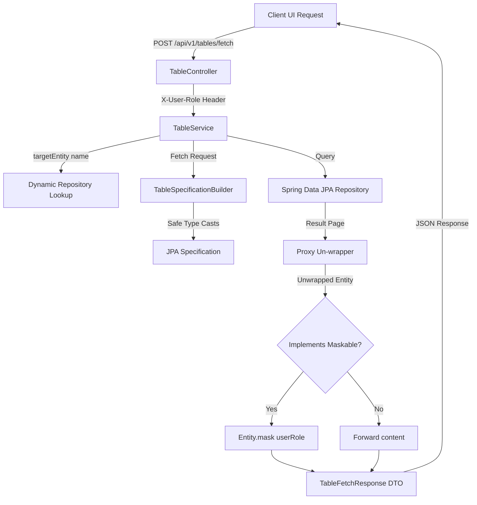

# Server-Side Table Model Framework Specification

The Table Model Framework provides a generic, highly scalable, and decoupled backend pipeline for retrieving database table records. It acts as a single, centralized database-agnostic router handling pagination, multi-sort chaining, global search, typed criteria filters, and role-based data masking (PII) for any registered entity.

---

## 1. Architectural Design



---

## 2. API Communication Contract

### Request Payload (`TableFetchRequest`)
Exposed at `POST /api/v1/tables/fetch`:

```json
{
  "targetEntity": "Employee",
  "page": 1,
  "pageSize": 10,
  "searchQuery": "Sarah",
  "filters": [
    {
      "key": "dept",
      "value": ["Engineering Fleet", "DevOps Infrastructure"]
    }
  ],
  "sortFields": [
    {
      "sortBy": "name",
      "sortOrder": "ASC"
    }
  ]
}
```

---

## 3. Core Framework Components

The framework is located under package `com.lazyinventor.forge_table.framework`:

### A. DTO Models (`framework.dto`)
* **`TableFetchRequest`**: Holds paging index, pageSize, search strings, sort parameters, and filter conditions.
* **`TableFetchResponse<T>`**: Wraps queried content lists, total pages count, page indices, and total element records.

### B. Specification Engine (`framework.specification`)
* **`TableSpecificationBuilder`**:
  * Inspects entity attributes at runtime using the JPA `Root.getModel().getAttribute(key).getJavaType()` metadata API.
  * Translates untyped JSON filters (such as Integers/Doubles) into the entity's native Java types before running queries.
  * Implements OR-chaining on all string-based columns when `searchQuery` is provided.
  * Handles multi-select filtering using criteria `.in(...)` statements.

### C. Repository Resolver & Masking Service (`framework.service`)
* **`TableService`**:
  * Reads the Spring Application Context at startup and maps database entities to their respective repository beans dynamically by parsing generic type declarations.
  * Translates frontend page settings to JPA `PageRequest` sorting chains.
  * Un-proxies Hibernate Lazy Loading proxies and Spring AOP advice wrappers before invoking PII masking logic.
* **`Maskable` (`framework.security`)**:
  * Interface implemented by `@Entity` classes. Defines `void mask(String userRole)`.
  * Used to obfuscate sensitive fields (e.g. setting fields to `null` or `***-**-****` placeholders) before serialization.

---

## 4. How to Register a New Table Model (Developer Guide)

Adding support for a brand new table structure requires **zero changes** to the framework layer. To add an entity (e.g., `Asset`), follow these four steps:

### Step 1: Create the `@Entity` Database Class
Define your schema fields inside the product package `com.lazyinventor.forge_table.product.entity`:

```java
package com.lazyinventor.forge_table.product.entity;

import jakarta.persistence.Entity;
import jakarta.persistence.Id;
import lombok.Data;

@Data
@Entity
public class Asset {
    @Id
    private String id;
    private String name;
    private String serialNumber;
    private Double purchaseValue;
    private String location;
}
```

### Step 2: Create the Spring Data Repository
Declare the repository interface inside the product package `com.lazyinventor.forge_table.product.repository`. It **must** extend both `JpaRepository` and `JpaSpecificationExecutor`:

```java
package com.lazyinventor.forge_table.product.repository;

import com.lazyinventor.forge_table.product.entity.Asset;
import org.springframework.data.jpa.repository.JpaRepository;
import org.springframework.data.jpa.repository.JpaSpecificationExecutor;
import org.springframework.stereotype.Repository;

@Repository
public interface AssetRepository extends JpaRepository<Asset, String>, JpaSpecificationExecutor<Asset> {
}
```

### Step 3: (Optional) Implement PII Data Masking
If the entity contains fields that should be hidden from standard users (e.g., `purchaseValue`), implement the `Maskable` interface:

```java
package com.lazyinventor.forge_table.product.entity;

import com.lazyinventor.forge_table.framework.security.Maskable;
import jakarta.persistence.Entity;
import jakarta.persistence.Id;
import lombok.Data;

@Data
@Entity
public class Asset implements Maskable {
    @Id
    private String id;
    private String name;
    private String serialNumber;
    private Double purchaseValue;
    private String location;

    @Override
    public void mask(String userRole) {
        if (!"ADMIN".equalsIgnoreCase(userRole)) {
            // Mask purchase price from non-admins
            this.purchaseValue = null;
        }
    }
}
```

### Step 4: Mount the Client-Side Screen
Inside the Next.js React frontend, initialize your `useDataTableState` hook and point `targetEntity` to the exact name of your entity (case-sensitive, e.g., `"Asset"`):

```typescript
const { state, processedData } = useDataTableState<AssetData>({
  data: serverData,
  columns,
  totalCount: totalCount,
  isServerSide: true,
  initialState: {
    pagination: { pageIndex: 0, pageSize: 10 }
  }
});

// The useEffect fetch payload maps targetEntity dynamically:
const body = {
  targetEntity: "Asset",
  page: state.pagination.pageIndex + 1,
  pageSize: state.pagination.pageSize,
  searchQuery: state.searchQuery,
  filters: Object.entries(state.filters).map(([key, value]) => ({ key, value }))
};
```
The dynamic registry automatically maps the request to the `AssetRepository` bean, applies location/name specifications, runs the query, unwraps the proxy, runs the `mask()` security filter, and returns the response.
